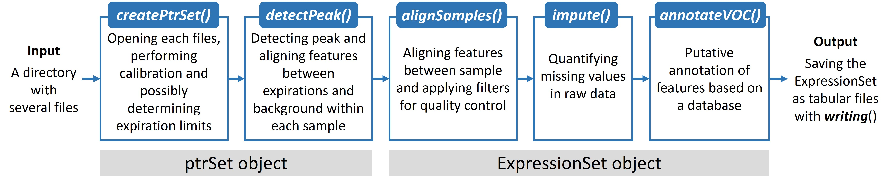

```{r set, include=FALSE}
knitr::opts_chunk$set(fig.width=12, fig.height=8) 
```

# Installation 

```{r, eval=FALSE}
if(!requireNamespace("BiocManager", quietly = TRUE))
    install.packages("BiocManager")
BiocManager::install("ptairMS")
```

# Introduction

The _**ptairMS**_ package provides a workflow to process PTR-TOF-MS raw data in the open Hierarchical Data Format 5 ([HDF5](https://www.hdfgroup.org); .h5 extension), and generate the peak table as an `ExpressionSet` object for subsequent data analysis with the many methods and packages available in [_**R**_](https://www.r-project.org/). Applications include the analysis of exhaled breath, cell culture headspace or ambient air. The package offers several features to check the raw data and tune the few processing parameters. It also enables to include new samples in a study without re-processing all the previous data, providing a convenient management for cohort studies (e.g. duration of the inclusion process, longitudinal studies, etc.).

Proton Transfer Reaction - Mass Spectrometry (PTR-MS) has emerged with excellent sensitivity and specificity for VOC analysis in a wide range of applications, including environment, food quality, and biology [[@blake_proton-transfer_2009]](https://doi.org/10.1021/cr800364q). In the area of health and care, PTR-MS opens up unique opportunities for real-time analysis *at the patient's bedside*.

# Volatolomics
The characterization of volatile organic compounds (VOCs) emitted by living organisms is of major interest in medicine, food sciences, and ecology. As an example, thousands of VOCs have been identified in the exhaled breath, resulting from normal metabolism or pathological processes [[@de_lacy_costello_review_2014]](https://doi.org/10.1088/1752-7155/8/1/014001). The main advantage of breath analysis in medicine is that the sampling is non-invasive [[@devillier_metabolomics_2017]](https://doi.org/10.2174/1381612823666170130155627). Methods based on mass spectrometry (MS) are the reference technologies for VOC analysis because of their sensitivity and large dynamic range.

# The _**ptairMS**_ processing workflow



The workflow consists of five steps:

1. `createPtrSet`: A `ptrSet` object is generated by taking as input the name of the directory containing the raw files (in HDF5 format), possibly grouped into subfolders according to classes of samples

2. `detectPeak`: peak detection and quantification are performed within each file and the `ptrSet` object is updated with the sample metadata, the peak list for each sample, and several quality metrics

3. `alignSamples`: The peak lists are aligned between samples and an `ExpressionSet` object is returned, containing the table of peak intensities, the sample metadata, and the feature metadata (which can be accessed with the `exprs`, `pData` and `fData` methods from the `Biobase` package, respectively)

4. `imputing`: Missing values in the table of intensities may be replaced by the integrated signal in the expected raw data region

5. `annotateVOC`: Features may be annotated, based on the [**Human Breathomics Database**](https://hbdb.cmdm.tw) [[@kuo_human_2020]](https://doi.org/10.1093/database/baz139)

# Datasets (_**ptairData**_ package)

Two real PTR-TOF-MS raw data sets are available in the _**ptairData**_ package.

- **exhaledAir**: Exhaled air from two healthy individual: three acquisitions per individual (with two expirations per acquisition), on distinct days [6 files]

- **mycobacteria**: cell culture headspace: two replicates from two species and one control (culture medium) [6 files]

Note: To limit the size of the data and speed up the analysis, the raw data are truncated in the mass dimension within the range $[20.4,21.6] \cup [50,150]$ for individuals, and $[20.4,21.6] \cup [56.4,90.6]$ for mycobacteria.


# Hands on

```{r package, message = FALSE, warning = FALSE}
library(ptairMS)
library(ptairData)
```

## Graphical Interface 

The whole workflow of ptairMS can be run interactively through a graphical user interface, which provides visualizations (expiration phases, peaks in the raw data, peak table, individual VOCs), quality controls (calibration, resolution, peak shape and evolution of reagent ions depending on time), and exploratory data analysis.

```{r, eval=FALSE}
ptairMS::RunShinnyApp()
```

Alternatively, the workflow can be run on the command line. We describe hereafter the main steps and parameters.

## `createPtrSet`: Checking raw data and setting parameters

The analysis starts from a directory containing the raw data. For this example, we use the **exhaledAir** from the _**ptairData**_ package:

```{r ptairData}
dirRaw <- system.file("extdata/exhaledAir", package = "ptairData")
```

Before processing the data, there are two important steps: 

- calibrate the mass axis

- determine the time periods of interest within the acquisitions (i.e., expirations or headspace analysis duration in our examples)

To perform these steps and check the quality of the raw data, we first use the `createPtrSet` function which, for each file:

* reads the raw data

* performs calibration on the `calibrationPeriod` sum spectra, with the `mzCalibRef` reference masses (see the *Calibrating the mass axis* section)

* determines the expiration time limits (or headspace duration for bacteria example) on the **trace** of `mzBreathTracer` mass or on the **total sum trace** if this parameter is `NULL`, with the `fracMaxTIC` parameter (see the *Determine the time limits for expirations or headspace duration* section)

* builds a default `sampleMetadata` table with the file names, date and possibly the subdirectories

This function creates a unique `ptrSet` object for the whole study, which contains all necessary information about the files: calibration parameters, time limits, peak lists (at this step they are empty), and primary ion quantification. The corresponding raw files are available in the _**ptairData**_ companion package.

Importantly, the `ptrSet` may be updated if new files are added or deleted from the directory, with the function `updatePtrSet` (see the *Updating the ptrSet* section).

To create a `ptrSet` object form the raw data directory:
```{r createPtrSet}
exhaledPtrset <- createPtrSet(dir=dirRaw,
                     setName="exhaledPtrset",
                     mzCalibRef = c(21.022, 60.0525),fracMaxTIC = 0.7,
                     saveDir = NULL )
```

```{r}
exhaledPtrset
```

To get the list of the file names in your directory (at the last time the `ptrSet` was created or updated), use `getFileNames`:
```{r getFileNames}
getFileNames(exhaledPtrset)
```

To check the quality and view useful information about your files, you can use the `plot` method on the `ptrSet`, that provides four plots:

* `calibError`: the calibration error boxplot in ppm

* $\frac{m}{\Delta m}$: an estimation of the resolution for the  `mzCalibRef` peaks

* the average normalized shape of the `mzCalibRef` peaks

* The primary ion isotope intensity in cps in function of acquisition date

```{r plot}
plot(exhaledPtrset)
```

We will now quickly explain each step of this function, and show how to choose and check the quality of the `mzCalibRef`, `mzBreathTracer` and `fracMaxTIC`  parameters.

### Calibrating the mass axis

To convert Time Of Flight (TOF) axis to mass-to-charge ratio (mz), the following formula is used [[@muller_new_2013]](https://doi.org/10.1016/j.chemolab.2013.06.011):

- $mz = \Big (\frac{TOF-b}{a} \Big)^2$

To estimate the parameters `(a,b)`, reference peaks with known masses (and without overlapping peaks) are needed. For optimal results, the calibration peaks have to be well distributed over the entire m/z axis. The masses of the calibration peaks are set with the `mzCalibRef` parameter, in an numeric vector. For exhaled air, we propose by default 6 peaks (two of them are suggested by the IONICON manufacturer): 

```{r calib table}
calib_table<-read.csv(system.file("extdata", "reference_tables/calib_table.tsv", package = "ptairMS"),sep="\t")
knitr::kable(calib_table)
```

Other reference masses (at least two) can be provided by the user. 

Since there may be a drift of mass calibration of the instrument during the acquisition, e.g. due to low change of temperature, periodic calibration is performed every `calibrationPeriods` seconds (default 60): correction of the drifts is then performed by linear interpolation, by using the first calibration as the reference. 

If a mass contains one or several outlier values on the summary plot (i.e. an error > 20 ppm) for specific files, you can check those files with the function `plotCalib` that plots the **Average total ion spectrum** around all the `mzCalibRef` (with the exact masses as red vertical lines), after calibration drift correction. 

```{r calibration}
plotCalib(exhaledPtrset,fileNames=getFileNames(exhaledPtrset)[1])
```

You can then choose to keep or delete these masses from `mzCalibRef`. To change the calibration masses, use the `calibration` function on the `ptrSet` object.

In our dataset example, since we have truncated the mass axis, only two masses from those listed above are present. To calibrate with three masses, we therefore add the peak 75.04406 ([C3H6O2+H]+, Hydroxyacetone). 

```{r plotCalib}
exhaledPtrset <- calibration(exhaledPtrset, mzCalibRef =  c(21.022, 60.0525,75.04406))
plot(exhaledPtrset,type="calibError")
```


### Determine the time limits of expirations or headspace duration

To see and change the expirations or headspace duration, use the `changeTimeLimits` function that opens the `Shiny` application for interactive visualization and selection, or use the `timeLimits` function. 

The limits are determined on the total trace if `mzBreathTracer` is `NULL`, or on the trace around `mzBreathTracer` mass. They correspond to the part of the trace where the intensity is higher than `fracMaxTIC * max(TIC)`, after baseline removal if `baseline` is set to `TRUE`.

Note: To analyze the entire spectrum (e.g. in ambient air studies), set `fracMaxTIC = 0`.


```{r shinny app, eval=FALSE}
exhaledPtrset <- changeTimeLimits(exhaledPtrset)
```

Example of expiration detection at `fracMaxTIC = 0.5` on a single file:
```{r timeLimits1}
samplePath <-getFileNames(exhaledPtrset,fullNames = TRUE)[1]
sampleRaw <- readRaw(samplePath, calib = FALSE)
expirationLimit <- timeLimits(sampleRaw,fracMaxTIC =  0.5,plotDel = TRUE, mzBreathTracer = 60.05)
expirationLimit <- timeLimits(sampleRaw,fracMaxTIC =  0.9,plotDel = TRUE,mzBreathTracer = NULL)
```

Note: You can also see the expiration limits on all or several files from the `ptrSet` with the `plotTIC` function. By default, when `fileNames` is `NULL`, all TICs files are plotted. A pdf file may be generated by setting the `pdfFile` argument to the absolute file path ending with the `.pdf` extension. Finally, you can remove the baseline by setting `baselineRm = TRUE`, and add the time limits to the plot by setting `showLimits = TRUE`. Coloring the TICs according to a column from the sampleMetadata is also possible by indicating the column name as the `colorBy` parameter. 

```{r plotTIC1}
plotTIC(object = exhaledPtrset,baselineRm = TRUE,type = "ggplot")
```

### Managing sample metadata

The `createPtrSet` function automatically generates a default sampleMetadata `data.frame`. It contains the file names as row names, a column named 'subfolder' when the files are organized into subfolders in the parent directory, and a column date with the date and hour of the acquisition. To get this data frame, use the `getSampleMetadata` method. Remember that the row names of the `sampleMetadata` must always correspond to all the file names from the directory. 

```{r getSampleMetadata}
getSampleMetadata(exhaledPtrset)
```

You can at any moment obtain this default sample metadata with the function `resetSampleMetadata(exhaledPtrset)`.

To modify the sample metadata, there exists two different ways: 

- `setSampleMetadata` method: modify the data frame in your R session and set it back into the `ptrSet` object.

```{r setSampleMetadata}
sampleMD <- getSampleMetadata(exhaledPtrset)
colnames(sampleMD)[1] <- "individual"  

exhaledPtrset <- setSampleMetadata(exhaledPtrset,sampleMD)
getSampleMetadata(exhaledPtrset)
```

- `exportSampleMetada` and `importSampleMetadata` methods: `exportSampleMetada` saves the data.frame in the `.tsv` format in the directory of your choice. The parameter `saveFile` must always have the `.tsv` extension. You can open and modify it on any spreadsheet editor, but **row names must never be modified**: if one of the files happens to be missing from the row names during the subsequent import, an error will be thrown. Once the `.tsv` file has been modified, it can be imported back into the `ptrSet` object, with the function `importSampleMetadata`.

```{r exportSampleMetada,eval=FALSE}
exportSampleMetada(exhaledPtrset, saveFile = file.path(DirBacteria,"sampleMetadata.tsv"))
exhaledPtrset <- importSampleMetadata(exhaledPtrset, file = file.path(DirBacteria,"sampleMetadata.tsv"))
```

### Saving

When calling the `createPtrSet` function, you may use the `saveDir` argument to save the `ptrSet` object in the directory of your choice, with `setName` parameter as name (the `.RData` extension will automatically be added at the end of the file name). Subsequent import of the saved `ptrSet` object relies on the classical `load` function.

### Plot raw data

There exist two functions for plotting the raw data:

- `plotRaw`: Displays for a file the image of the matrix of intensities, the **Extracted Ion Chromatogram (EIC)**, the **Extracted Ion Spectrum (EIS)**, for the selected m/z and time ranges, and all the putative annotations available in the `vocDB` within this mz range (no peak detection has yet been done as this step)

```{r plotRaw_ptrSet}
plotRaw(exhaledPtrset, mzRange = 59 , fileNames = getFileNames(exhaledPtrset)[1],showVocDB = TRUE)
```

- `plotFeatures`: for all selected files, the average spectrum for all time periods is plotted, with the background superimposed as a dashed line. As with the `plotTIC` function, you can choose the type of display (`plotly` or `ggplot`), and the possibility to color spectra individually by indicating a column name of the sample Metadata

```{r plotFeatures, message=FALSE, warning=FALSE}
plotFeatures(exhaledPtrset,mz=59.049,type="ggplot",colorBy = "individual")
```

## `updatePtrSet`: Updating the ptrSet

If you delete or add files to the directory after the `ptrSet` object has been created, the `updatePtrSet` function must be run.

```{r, update}
exhaledPtrset <- updatePtrSet(exhaledPtrset)
```

## `detectPeak`: Peak detection and quantification

Now that we have checked that the calibration is efficient, and that the expiration or headspace time limits are correct, the peaks can be detected and quantified in each file with the `detectPeak` function, which works on the `ptrSet` object (and the corresponding raw files).

For each file in the directory, this function:

- performs the calibration of the mass axis every `calibrationPeriod` second

- detects peaks on the total ion spectrum with an untargeted peak picking algorithm 

- estimates the temporal evolution of each detected peak with a 2-dimensional model

- quantifies each peak in both exhaled air and background, in cps, ncps (normalized by the primary ion, H3(O18)+ * 488) and ppb [[@hansel_proton_1995]] units, and stores the corresponding information in the `peakList` slot of the ptrSet object as a list of ExpressionSet objects (see below)

- performs two unilateral t-test comparing the mean intensities between background and expiration/headspace phases, and stores the *p*-value in the `peakListAligned` slot

The `peakList` is then written in the `ptrSet` object as a list of `ExpressionSet`, each containing all the peaks detected in one file (e.g., sample; see below for the details of the ExpressionSet content).

```{r Detect_peak}
exhaledPtrset <- detectPeak(exhaledPtrset)
```

The peak detection may be restricted to specific nominal masses with the `mzNominal` argument: for example `exhaledPtrset <- detectPeak(exhaledPtrset ,  mzNominal = c(5,60))`. 

The peak detection step may take a few minutes if there are many files and a large m/z range (1 to 2 minutes for files for files with an average acquisition time of 3 minutes) . Parallel computing is available by setting `parallelize = TRUE` and by giving the number of available cores of your computer in `nbCores`. To find the number of CPU cores available in your computer, use `parallel::detectCores()`.

To see the resulting peak lists, use the `getPeakList` method. It returns a list of ExpressionSet, where:

- assay Data: the matrix of peak intensities, with m/z peak centre as row names, and the quantification in cps at each time point

- feature Data: the data frame with  m/z peak centre as row names, and the following columns:

    * quanti_unit: the mean of the quantifications for all expiration/headspace phases
    * background_unit: the mean of the quantifications for all background phases 
    * diffAbs_unit: the mean of the quantifications for all expiration/headspace phases after baseline subtraction
    * pValLess/ pValGreater: the *p*-value of the unilateral t-test, which tests that quantification (in cps) of expiration points are less/greater than the intensity of the background. 
    * lower/upper: integration boundaries
    * parameter peak: estimated peak parameters (width et left and rigth and height)


```{r getPeakList}
peakList<-getPeakList(exhaledPtrset)
peakList1<-peakList$`ind1-1.h5`
X<-Biobase::exprs(peakList1)
Y<-Biobase::fData(peakList1)
mz<-Y[,"Mz"]
plot(X[which.min(abs(mz-59.0498)),],ylab="cps",xlab="time",main=paste("Temporal evolution of acetone "))
head(Y)
```


## Updating the `ptrSet` peak lists with `detectPeak`

As described previously, an important feature of the _**ptairMS**_ package is the possibility to update the `ptrSet` object linked to a directory, as new data files are added and included in this directory. In such a case, we have seen that the `updatePtrSet` function must be used to reset the sample metadata or append it. Then, the `detectPeak` function must be used on the updated `ptrSet` to compute the additional peak lists.

```{r updatePtrSet,eval=FALSE}
exhaledPtrset<-updatePtrSet(exhaledPtrset)
exhaledPtrset<-setSampleMetadata(exhaledPtrset,resetSampleMetadata(exhaledPtrset))
exhaledPtrset<-detectPeak(exhaledPtrset)
```

## `alignSamples`: Aligning features between samples

The alignment between samples (i.e. the matching of variables between the peak lists within the `ptrSet` object) is performed by using a kernel gaussian density [[@delabriere_profia_2017]](https://doi.org/10.1093/bioinformatics/btx458).

The `alignSamples` returns an `ExpressionSet` object, with the table of peak intensities which has just been built, the sample meta data (borrowed from the input `ptrSet`) and the variable meta data which contains peak intensities in the background.

It is possible to apply two filters:

- On the background: only variables with a significant higher intensity in the expiration phases compared to the background phases (at the `pValGreaterThres` p-value threshold) for `fracExp` % of the samples are kept

- On sample reproducibility: only variables which are detected in more than `fracGroup` percent of the samples (or percent of at least one `group`) are kept.

If you do not want to apply those filters, set `fracGroup` to 0 and `pValGreaterThres` to 1.

```{r Align patient}
exhaledEset <- alignSamples(exhaledPtrset, group="individual", fracGroup = 1, fracExp=1/6)
```

The three tables from the `ExpressionSet` can be accessed with the classical `exprs`, `pData`, and `fData` accessors:
```{r}
knitr::kable(head(Biobase::exprs(exhaledEset)))
knitr::kable(head(Biobase::pData(exhaledEset)))
knitr::kable(head(Biobase::fData(exhaledEset)))
```

Note: The `view` method from the [_**ropls**_](https://doi.org/10.18129/B9.bioc.ropls) package may be used to print these tables:

## `imputing`: Imputation of missing values

To impute missing values, _**ptairMS**_ returns back to the raw data, and performs the quantification with the same method as `detectPeak` but this time without any limit of detection. 

```{r impute}
exhaledEset <- ptairMS::impute(exhaledEset,  exhaledPtrset)
```

## `annotateVOC`: Annotation

_**ptairMS**_ provides putative annotations by matching the measured ion masses to the [Human Breathomics Database](https://hbdb.cmdm.tw) [[@kuo_human_2020]](https://doi.org/10.1093/database/baz139). Applied to an `ExpressionSet`, it appends the feature metadata (`fData`) with new columns containing chemical information (formulas, IUPAC name, InChI, etc.), as well as the isotopes for nuclides C13, O17 and O18. 

```{r}
annotateVOC(59.049)
exhaledEset<-annotateVOC(exhaledEset)
knitr::kable(head(Biobase::fData(exhaledEset)))
```

## `writeEset`: Export data and metadata to 3 tabular files

Finally, the `ExpressionSet` can be exported to 3 tabulated files 'dataMatrix.tsv', sampleMetadata.tsv', and 'variableMetadata.tsv':

```{r,eval=FALSE}
writeEset(exhaledEset, dirC = file.path(getwd(), "processed_dataset"))
```

## Statistical analysis 

The `ExpressionSet` object is now ready for subsequent data analysis (e.g. data mining, classification or feature selection) with the many R packages.

As an example, we describe here how to perform **Exploratory Data Analysis** with the [_**ropls**_](https://doi.org/10.18129/B9.bioc.ropls) package [[@thevenot_analysis_2015]](https://doi.org/10.1021/acs.jproteome.5b00354).

As a preliminary step, log transformation is often used in Mass Spectrometry to stabilize the variance:

```{r log_transform}
Biobase::exprs(exhaledEset) <- log2(Biobase::exprs(exhaledEset))
```

Then, the data and metadata may be printed and plotted with the `view` method:

```{r view}
ropls::view(Biobase::exprs(exhaledEset),printL=FALSE)
```

To avoid redundancy, the isotopes may be discarded:

```{r discarding isotopes}
isotopes<-Biobase::fData(exhaledEset)[,"isotope"]
isotopes<-isotopes[!is.na(isotopes)]
exhaledEset <- exhaledEset[!(Biobase::fData(exhaledEset)[, "ion_mass"] %in% isotopes), ]
```

**Principal Component Analysis** may then be performed (due to the limited number of samples, cross-validation is decreased to 5 instead of 7):

```{r pca}
exhaledPca<-ropls::opls(exhaledEset,crossvalI=5,info.txtC="none",fig.pdfC="none")
ropls::plot(exhaledPca, parAsColFcVn=Biobase::pData(exhaledEset)[, "individual"],typeVc="x-score")

```

Subsequent supervised analysis, e.g. **(Orthogonal) Partial Least Squares**, or feature selection may be performed with the [_**ropls**_](https://doi.org/10.18129/B9.bioc.ropls) and [_**biosigner**_](https://doi.org/10.18129/B9.bioc.biosigner) packages, respectively. 

To get the most important variable that contribute to the dimension that discriminate the two individual (here the first dimension), we look at the loadings:

```{r}
load1<-ropls::getLoadingMN(exhaledPca)[,1]
barplot(sort(abs(load1),decreasing = TRUE))
knitr::kable(Biobase::fData(exhaledEset)[names(sort(abs(load1),decreasing = TRUE)[1:10]),c("vocDB_ion_formula","vocDB_name_iupac")])
```

We then could plot the raw data around this masses to check the robustness of these potential marker:

```{r plotFeatures individual, warning=FALSE}
plotFeatures(exhaledPtrset,mz = 53.0387,typePlot = "ggplot",colorBy = "individual")
plotFeatures(exhaledPtrset,mz = 67.0539,typePlot = "ggplot",colorBy = "individual")
```

## Mycobacteria dataset

The package can also be used to process data from headspace analysis (e.g., cell culture headspace). The acquisition phase is detected on the total ion trace, in a similar way as for exhaled air. The *mycobacteria* dataset contains two replicates from two bacterial species and one control (culture medium). The 6 corresponding raw files are available in the companion **ptairData** package.

```{r}
dir <- system.file("extdata/mycobacteria",  package = "ptairData")
mycobacteriaSet <- createPtrSet(dir = dir, setName = "test", 
                         mzCalibRef = c(21.022,59.049))
mycobacteriaSet <- detectPeak(mycobacteriaSet, smoothPenalty = 0)
plotTIC(mycobacteriaSet,type="ggplot",showLimits = TRUE,file="Specie-a2.h5")
eSet <- alignSamples(mycobacteriaSet)
eSet<-impute(eSet,ptrSet = mycobacteriaSet)
X<-Biobase::exprs(eSet)
pca<-ropls::opls(log2(t(X)),predI =2,crossvalI=5,info.txtC = "none",
  fig.pdfC = "none")
ropls::view(log2(X),printL=FALSE)
plot(pca,type="x-score")
```


## Processing a single raw file

To read and access the entire raw data of a single file, use the `readRaw` function. It opens the data from an absolute file path with the [_**rhdf5**_](https://doi.org/10.18129/B9.bioc.rhdf5) library, and returns a `ptrRaw` object containing the raw data matrix, the time axis, the m/z axis obtained after calibration if `calibTIS = TRUE`, and additional information contained in the h5 file (transmission curve, drift temperature, ...).

As an example, we get the absolute file path for the first raw file:
```{r readRaw}
dirRaw <- system.file("extdata/exhaledAir", package = "ptairData")
samplePath<-list.files(dirRaw,recursive = TRUE,full.names = TRUE,pattern = ".h5$")[1]
```

To read the file:
```{r}
sampleRaw <- readRaw(samplePath, calib = FALSE)
sampleRaw
```

At this stage, the same methods as with the `ptrSet` object can be used: `calibration`, `timeLimits`, `plotCalib`, `plotTIC`, `plotRaw`, and `detectPeak`.

# Acknowledgements

This research was conducted by Camille Roquencourt, with the contributions from Paul Zheng, Pierrick Roger-Mele and Etienne A. Thevenot ([**Data Sciences for Deep Phenotyping and Precision Medicine team**](https://scidophenia.github.io/) at CEA), in collaboration with Stanislas Grassin-Delyle, Helene Salvator, Emmanuel Naline, Philippe Devillier and Louis-Jean Couderc ([**Exhalomics platform**](https://www.pluginlabs-universiteparissaclay.fr/fr/entity/915199-exhalomics-plateforme-danalyse-de-lair-expire) at the Foch Hospital) within the [**SoftwAiR project**](https://anr.fr/Projet-ANR-18-CE45-0017) funded by the Agence Nationale de la Recherche (ANR-18-CE45-0017 grant).


# Session Info

```{r sessionInfo}
sessionInfo()
```

# Bibliography

